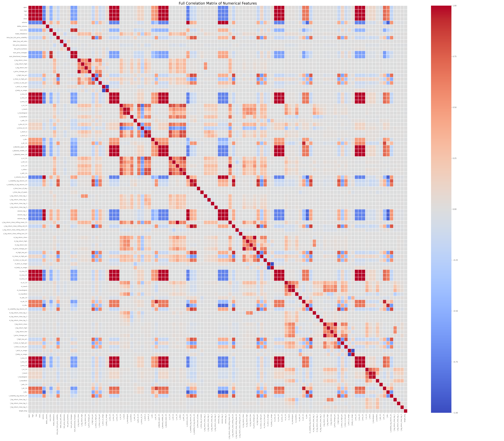

# Project Minotaur: Multi-Timeframe Crypto Signal Model (5 m / 15 m / 4 h)

## 1 · Project Overview

Minotaur is an end-to-end research pipeline for BTC/USDT that transforms raw OHLCV data on **5-minute, 15-minute, and 4-hour** intervals into more than 600 engineered features, then trains a **CNN-Transformer** classifier to predict if price will reach a 2 : 1 take-profit before an adaptive stop-loss.

*Historical benchmark*: a single-stack CNN-Transformer (Run 038) achieved **AUC ≈ 0.68** and **precision ≈ 0.60** (calibrated) on unseen test data. The current code base reproduces and extends that pipeline with a fully modular feature engine, Optuna hyper-parameter search, and isotonic probability calibration.

> **Note**  Earlier experiments with tick-level *dollar bars* are not part of the public workflow and are intentionally omitted from this README.

---

## 2 · Data Flow at a Glance

```
Binance BTC/USDT 5 m CSV  ─┐
                          │   ┌────────────┐
Binance BTC/USDT 15 m CSV ─┼──▶│ Feature    │──┐  5 m sequences  │
                          │   │ Engine V2  │  ├─ 15 m sequences │
Binance BTC/USDT 4 h CSV  ─┘   └────────────┘  └─ 4 h sequences  ▼
                                                 CNN-Transformer → Calibrated probs → Threshold → Signal
```

1. **Raw OHLCV ingestion** (`data_preparation_pipeline/`)
2. **Feature generation** (`NN_trading_pipeline/feature_engine_v2.py`)
3. **Dataset assembly & scaling** (`chimera_5_19_optuna.py`)
4. **Model training / Optuna search** (`model_training/minotaur_v1.py`)
5. **Isotonic regression calibration + threshold optimisation**

---

## 3 · Feature Engineering (FeatureEngine V2)

The engine is fully streaming-compatible; it can calculate features live bar-by-bar once a warm-up history is buffered.

### 3.1 Core OHLCV Inputs

| Timeframe | Columns |
|-----------|---------|
| 5 m       | Open, High, Low, Close, Volume |
| 15 m (3×) | aggregated from 5 m |
| 4 h (48×) | aggregated |

### 3.2 Technical Indicator Families

* **Traditional TA-Lib** (per timeframe)
  * SMA/EMA (5→500 periods)
  * RSI, ATR/NATR, ADX, MACD, StochK/D, BBands, OBV, MFI, CCI
* **Rolling Stats**
  * Rolling mean / stdDev of log-returns
  * Percent rank / z-score
* **Volatility Metrics**
  * `volatility_N_tf` = stdDev(log-returns, _N_)
  * Multi-time-frame (MTF) volatility ratios
* **Divergence Detection** (`divergence_calculator.py`)
  * Bull / bear **RSI-14 divergences** on 15 m & 4 h (RSI 30/70 classic OR 40/60 "robust" thresholds)
* **Trend Regimes**
  * `Trend4H_State`: price vs SMA-200 on 4 h
  * Generic `TrendX_State` for arbitrary X (e.g., 15 m, 1 h)
* **Volatility & Volume Regimes**
  * 3-state quantile bucketing of ATR & Volume (`Vol5m_State`, `Volume5m_State`)
* **Candlestick Patterns**
  * TA-Lib CDL\, one-hot encoded per 5 m bar
* **Time Features**
  * Hour of day, day of week (cyclic sine/cosine pairs)

### 3.3 Feature Selection

A separate RF-importance script ranks features; the top-N list (100 by default) is read by the training script for rapid experimentation. Zero-variance & high-VIF columns are pruned automatically.

---

## 4 · Target Definition

Adaptive stop-loss / take-profit computed **per entry bar**:

```python
sl_dist = max(min_sl_pct * close, atr_multiplier * atr(close, atr_period))
tp_dist = reward_risk_ratio * sl_dist  # default 2.0

label = 1 if future_high ≥ close + tp_dist before future_low ≤ close − sl_dist else 0
```

Typical parameters: `min_sl_pct=1%`, `atr_multiplier=1.5`, `reward_risk_ratio=2.0`.
Class 1 frequency ≈ 33 % for BTC 2017-2024.

---

## 5 · Model Architecture

```
Input  (B, 60, F) ───────── Conv1D×3 (GLU-GELU, residual) ─┐
                                                           ↓
                                     Strided Conv (learned down-sampling)
                                                           ↓
                                 Feature-wise gating (Dense sigmoid ⊙)
                                                           ↓
                Positional Encoding + d_model projection (Dense  → 128-256)
                                                           ↓
            Transformer Encoder × {1-3} (heads 4-8, ff_dim 2-4×d_model)
                                                           ↓
                    AttentionPooling (learn weights across sequence)
                                                           ↓
                       MLP Head (Dense-GELU-Dropout) × {1-2}
                                                           ↓
                               Output sigmoid (1-unit)
```

### 5.1 CNN Stack Details

**Layer Configuration**:
- **3 Conv1D layers** with fixed architecture:
  - Layer 1: `filters=64, kernel=3, dilation=1`
  - Layer 2: `filters=64, kernel=5, dilation=2` 
  - Layer 3: `filters=64, kernel=7, dilation=3`
- **Gated Linear Units (GLUs)**: Each conv layer uses GLU activation with GELU in the data path
- **Residual Connections**: ResNet-style skip connections around each GLU block
- **Normalization**: BatchNormalization after each conv layer
- **Dropout**: SpatialDropout1D (rate: 0.05-0.3, Optuna-tunable)

**Strided Convolution Downsampling**:
- Replaces traditional MaxPooling1D with learnable downsampling
- `Conv1D(filters=64, kernel_size=2, strides=2, padding='same')`
- Reduces sequence length by factor of 2 (60 → 30 timesteps)
- Maintains 64 feature channels for Transformer input

**Feature Gating Mechanism**:
- `Dense(64, activation='sigmoid')` applied to strided conv output
- Element-wise multiplication: `gated_features = features * gate_weights`
- Allows model to learn feature importance dynamically

### 5.2 Transformer Configuration

**Architecture Parameters**:
- **d_model**: 128-256 (determined by `num_heads × head_size`)
- **Encoder blocks**: 1-3 layers (Optuna search space)
- **Multi-Head Attention**:
  - Heads: 4-8 (categorical choice)
  - Head size: 32-64 dimensions per head
  - Causal masking: `use_causal_mask=True`
- **Feed-Forward Networks**:
  - Hidden dim: `ff_dim_factor × d_model` (factor ∈ {2, 4})
  - Activation: GELU
- **Pre-Layer Normalization**: Applied before attention and FFN
- **Residual connections** around attention and FFN blocks
- **Dropout**: 0.10-0.25 (tied across attention and FFN)

**Attention Pooling**:
- Custom learnable aggregation replacing GlobalAveragePooling1D
- `Dense(d_model, activation='softmax')` → attention weights
- Weighted sum across sequence dimension: `∑(attention_weights * features)`

### 5.3 MLP Head Specifications

**Layer Configuration** (Optuna-tunable):
- **Layers**: 1-2 dense layers
- **Layer 1**: 32-128 units (categorical: {32, 64, 128})
- **Layer 2**: 16-64 units (if 2-layer) (categorical: {16, 32, 64})
- **Activation**: GELU (hidden layers), sigmoid (output)
- **Dropout**: Tied to transformer dropout + 0.05
- **L2 Regularization**: Applied to all dense layers

### 5.4 Training Configuration

* **Optimizer**: AdamW 
  - Learning rate: 1e-6 to 6e-5 (log-uniform)
  - Weight decay: 1e-5 to 8e-4 (log-uniform)
  - Gradient clipping: `clipnorm=1.0`
* **Learning Rate Schedule**: 
  - Linear warm-up (3 epochs) → Cosine decay
* **Loss Functions**: 
  - Binary Cross-Entropy (baseline)
  - Focal Loss: α ∈ [0.3, 0.7], γ ∈ [1.0, 3.0] (Optuna-tunable)
* **Batch Size**: 32 or 64 (categorical choice)
* **Sequence Length**: 60 timesteps (fixed)
* **Probability Calibration**: Isotonic regression on validation predictions

---

## 6 · Hyper-Parameter Optimisation (Optuna)

| Group          | Search Space (examples) |
|----------------|-------------------------|
| `learning_rate`| 1e-6 – 6e-5 (log-uniform)|
| `weight_decay` | 1e-5 – 8e-4             |
| CNN layers     | 1 – 3 layers × filters{16-128}, kernel{3,5,7}, dilation{1-4}|
| Transformer    | blocks{1-3}, heads{4-8}, head_size{32-64}, ff_dim_factor{2-4}|
| Dropouts       | 0.05 – 0.30             |
| Batch size     | 32 or 64               |
| Focal α/γ      | 0.3 – 0.7 / 1.0 – 3.0    |

Trials are stopped early via `val_auc` plateau & `best_val_f1` stagnation.

## 6.1 · Feature Correlation & Multicollinearity

To avoid redundant signals and reduce model variance we performed an extensive **correlation analysis** on the 600-feature candidate set.

* **Method**  `scripts/eda_analysis.py` (or `eda_time_bars_analysis.py`) loads a stratified 100 k-row sample and computes the full Pearson correlation matrix.
* **Visualization**  Heat-map (example shown below) highlights blocks of highly correlated indicators—e.g. overlapping MAs, duplicated RSI windows, volume variants.
* **Threshold pruning**  Pairs with |ρ| > 0.95 are filtered ⇒ feature count ↓ ~15 %.
* **Variance Inflation Factor (VIF)**  Additional pass removes features with VIF > 10.
* **Model-based ranking**  RandomForest feature importance on the training split ⇒ top-100 list (`top_100_rf_features.txt`) used for the fastest Optuna sweep.

> 

*Outcome*: final training set balances diversity (trend, momentum, volatility, regime) while eliminating multicollinearity, leading to faster convergence and improved generalisation.

---

## 7 · Performance Snapshot

| Run ID | Dataset | Features | SeqLen | Val AUC | Calibrated Test AUC | Precision | Recall | F1 |
|--------|---------|----------|--------|---------|---------------------|-----------|--------|----|
| **038**| 5 m base (legacy) | 88 | 60 | 0.71 | **0.68** | 0.60 | 0.28 | 0.38 |


> *Performance varies with market regimes; above table is indicative.*

---

## 8 · Quick Start

```bash
pip install -r requirements.txt  # TensorFlow 2.15+, TA-Lib, Optuna, Dask …

# 1. Create parquet features (offline batch example)
python NN_trading_pipeline/main_pipeline.py \
  --ohlcv-5m data/binance/BTCUSDT_5m.csv \
  --ohlcv-15m data/binance/BTCUSDT_15m.csv \
  --ohlcv-4h data/binance/BTCUSDT_4h.csv \
  --out-parquet data/features/BTCUSDT_full.parquet

# 2. Train a single model (no Optuna)
python model_training/minotaur_v1.py \
  --no-optuna --epochs 50 --feature-parquet data/features/BTCUSDT_full.parquet

# 3. Hyper-parameter sweep (50 trials)
python model_training/minotaur_v1.py \
  --n-trials 50 --epochs 100 --feature-parquet data/features/BTCUSDT_full.parquet \
  --optuna-study-name minotaur_sweep_May25
```

---

## 9 · Research Directions

* **Mamba state-space models** for ultra-long sequences
* **Cross-asset feature transfer** (ETH, SOL)
* **On-chain metrics** integration
* **Reinforcement-learning overlay** for position sizing

---

## 10 · License & Disclaimer

This repository is released for educational and research purposes only. It is **not** financial advice. Trading cryptocurrencies is highly speculative. Use at your own risk.
